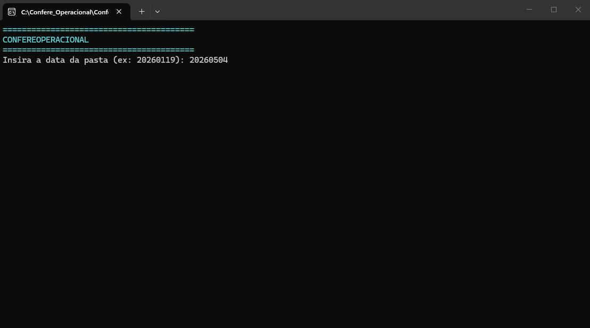
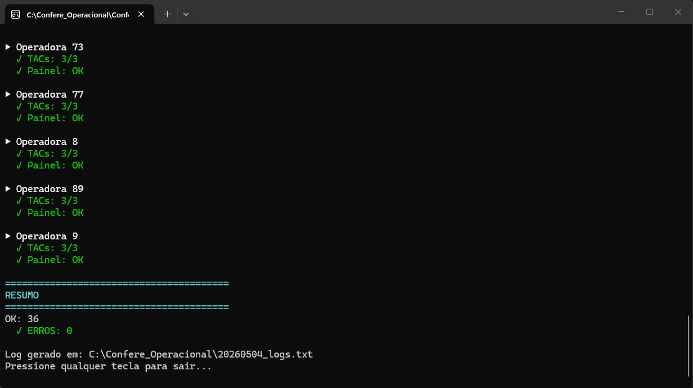
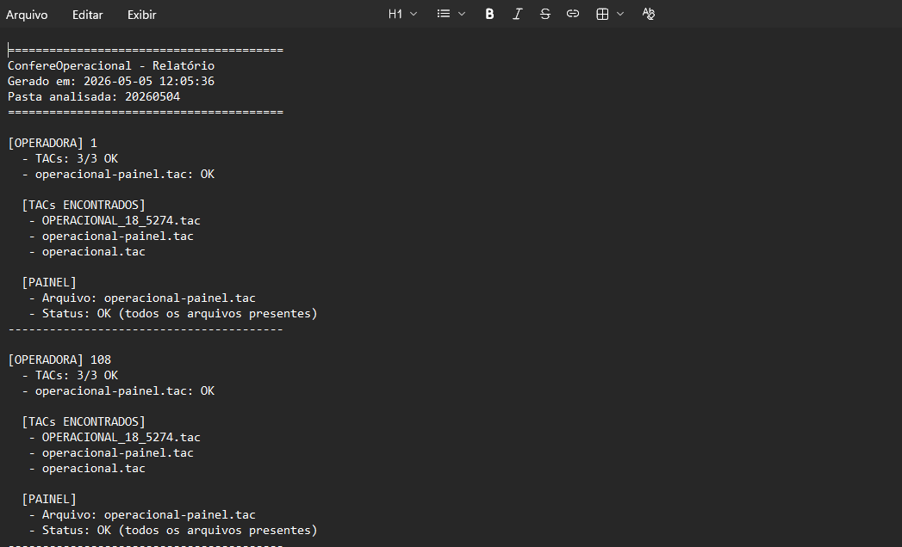

# ConfereArquivoOperacional

Aplicação console desenvolvida em **C# / .NET** para validação automatizada de arquivos operacionais utilizados na comunicação, atualização e sincronização da frota municipal de ônibus de Belo Horizonte.

O programa é utilizado diariamente para conferir uma série de arquivos responsáveis por manter ônibus, catracas, servidores e sistemas operacionais devidamente atualizados, garantindo que informações como itinerários, linhas, motoristas e dados de operação sejam distribuídas corretamente para os veículos da frota.

---

## Sobre o projeto

O **ConfereArquivoOperacional** foi desenvolvido para automatizar a conferência de arquivos `.tac` utilizados em processos operacionais do transporte público.

Esses arquivos são fundamentais para manter a base de dados dos ônibus atualizada, incluindo informações de linhas, itinerários, motoristas, mensagens, configurações e dados utilizados por sistemas embarcados e servidores.

Antes da automação, esse tipo de conferência poderia exigir validação manual de várias pastas e arquivos por operadora. Com o sistema, a análise é feita de forma rápida, padronizada e com geração automática de relatório, reduzindo falhas humanas e aumentando a confiabilidade do processo.

---

## Importância operacional

Este programa auxilia diretamente na validação de arquivos que impactam o funcionamento diário da operação da frota municipal de Belo Horizonte.

A conferência correta desses arquivos contribui para:

- Manter os ônibus comunicando corretamente com servidores e sistemas.
- Atualizar bases de itinerários.
- Atualizar informações de linhas.
- Atualizar dados de motoristas.
- Validar arquivos utilizados por catracas e painéis.
- Conferir arquivos operacionais separados por operadora.
- Identificar arquivos ausentes ou inválidos.
- Gerar registros de validação para consulta e rastreabilidade.

Por ser utilizado em um ambiente operacional real, o sistema ajuda a evitar problemas causados por arquivos incompletos, incorretos ou ausentes.

---

### Entrada da data analisada

O usuário informa a pasta da data que deseja validar. A pasta segue o padrão utilizado no processo operacional.

---

### Resultado da validação no console

Durante a execução, o sistema percorre as operadoras e exibe o status dos arquivos encontrados, indicando se os `.tac` estão presentes e se o painel operacional está válido.

---

### Relatório gerado

Ao final da análise, o programa gera um log detalhado contendo a situação de cada operadora, os arquivos encontrados, o status do painel e o resumo geral da execução.

---

## Funcionalidades

- Validação automática de pastas por data.
- Leitura de múltiplas operadoras.
- Conferência da quantidade esperada de arquivos `.tac`.
- Verificação do arquivo `operacional-painel.tac`.
- Abertura e validação do `.tac` como arquivo compactado.
- Conferência dos arquivos obrigatórios dentro do painel.
- Exibição visual do status no console.
- Indicação de sucesso e erro por operadora.
- Geração automática de relatório `.txt`.
- Resumo final com quantidade de operadoras válidas e inconsistentes.
- Registro detalhado para auditoria e acompanhamento.

---

## Arquivos validados

O sistema verifica a presença dos arquivos `.tac` esperados dentro de cada pasta de operadora.

Exemplo:

~~~txt
OPERACIONAL_73_5274.tac
operacional.tac
operacional-painel.tac
~~~

Além disso, dentro do arquivo `operacional-painel.tac`, o sistema valida a existência dos arquivos obrigatórios utilizados no processo operacional.

Exemplo de arquivos internos validados:

~~~txt
buslines.upex
confgps.upex
messages.upex
motorista.upex
tripschedule.upex
version.txt
~~~

Esses arquivos estão relacionados a informações essenciais para a operação, como linhas, viagens, mensagens, motoristas, configurações e versionamento dos dados enviados.

---

## Exemplo de execução

Ao iniciar o programa, o usuário informa a data da pasta que será analisada:

~~~txt
========================================
CONFEREOPERACIONAL
========================================
Insira a data da pasta (ex: 20260119): 20260504
~~~

Após a validação, o sistema exibe o resultado por operadora:

~~~txt
▶ Operadora 73
  √ TACs: 3/3
  √ Painel: OK

▶ Operadora 77
  √ TACs: 3/3
  √ Painel: OK

▶ Operadora 8
  √ TACs: 3/3
  √ Painel: OK

▶ Operadora 89
  √ TACs: 3/3
  √ Painel: OK

▶ Operadora 9
  √ TACs: 3/3
  √ Painel: OK

========================================
RESUMO
========================================
OK: 36
ERROS: 0

Log gerado em: C:\Confere_Operacional\20260504_logs.txt
Pressione qualquer tecla para sair...
~~~

---

## Estrutura esperada

A pasta da data analisada deve estar no mesmo diretório do executável.

Exemplo de estrutura:

~~~txt
Confere_Operacional/
│
├── ConfereArquivoOperacional.exe
│
├── 20260504/
│   │
│   ├── 1/
│   │   ├── OPERACIONAL_1_5274.tac
│   │   ├── operacional.tac
│   │   └── operacional-painel.tac
│   │
│   ├── 73/
│   │   ├── OPERACIONAL_73_5274.tac
│   │   ├── operacional.tac
│   │   └── operacional-painel.tac
│   │
│   ├── 77/
│   │   ├── OPERACIONAL_77_5274.tac
│   │   ├── operacional.tac
│   │   └── operacional-painel.tac
│   │
│   └── ...
│
└── 20260504_logs.txt
~~~

---

## Exemplo de relatório gerado

O relatório `.txt` contém informações detalhadas sobre cada operadora analisada.

~~~txt
========================================
ConfereOperacional - Relatório
Gerado em: 2026-05-05 12:05:36
Pasta analisada: 20260504
========================================

[OPERADORA] 1
  - TACs: 3/3 OK
  - operacional-painel.tac: OK

[TACs ENCONTRADOS]
  - OPERACIONAL_1_5274.tac
  - operacional-painel.tac
  - operacional.tac

[PAINEL]
  - Arquivo: operacional-painel.tac
  - Status: OK (todos os arquivos presentes)

[OPERADORA] 108
  - TACs: 3/3 OK
  - operacional-painel.tac: OK

[TACs ENCONTRADOS]
  - OPERACIONAL_108_5274.tac
  - operacional-painel.tac
  - operacional.tac

[PAINEL]
  - Arquivo: operacional-painel.tac
  - Status: OK (todos os arquivos presentes)
~~~

---

## Como funciona

O fluxo de funcionamento do sistema é simples e direto:

1. O programa solicita a data da pasta que será analisada.
2. A aplicação localiza a pasta correspondente.
3. Cada subpasta de operadora é percorrida automaticamente.
4. O sistema verifica se existem os arquivos `.tac` esperados.
5. O arquivo `operacional-painel.tac` é analisado.
6. Os arquivos internos obrigatórios são conferidos.
7. O resultado é exibido no console.
8. Um relatório completo é gerado em `.txt`.

---

## Possíveis mensagens de status

| Status | Significado |
|---|---|
| `TACs: 3/3` | Todos os arquivos `.tac` esperados foram encontrados |
| `Painel: OK` | O arquivo `operacional-painel.tac` está presente e válido |
| `ERROS: 0` | Nenhuma inconsistência foi encontrada |
| `Log gerado` | O relatório da análise foi salvo com sucesso |

---

## Benefícios

- Redução de conferência manual.
- Maior velocidade na validação operacional.
- Padronização do processo.
- Menor risco de erro humano.
- Identificação rápida de arquivos ausentes.
- Identificação de inconsistências em arquivos operacionais.
- Geração automática de relatório.
- Apoio direto à rotina operacional da frota municipal.
- Maior confiabilidade na atualização de dados dos ônibus.

---

## Tecnologias utilizadas

- C#
- .NET
- Console Application
- Manipulação de arquivos
- Leitura de diretórios
- Validação de arquivos compactados
- Geração de logs em `.txt`

---

## Como executar

### Pré-requisitos

É necessário possuir o .NET instalado na máquina.

Para verificar a instalação:

~~~bash
dotnet --version
~~~

### Executar em modo desenvolvimento

~~~bash
dotnet run
~~~

### Gerar build em Release

~~~bash
dotnet build -c Release
~~~

### Executar o programa publicado

~~~bash
ConfereArquivoOperacional.exe
~~~

---

## Organização das imagens no repositório

Para exibir corretamente os prints neste README, utilize a seguinte estrutura:

~~~txt
ConfereArquivoOperacional/
│
├── assets/
│   ├── entrada-data.png
│   ├── resultado-console.png
│   └── log-gerado.png
│
├── ConfereArquivoOperacional/
├── README.md
└── ...
~~~

---

## Aplicação prática

Este projeto foi criado para resolver uma necessidade real do ambiente operacional, onde a conferência correta dos arquivos é essencial para manter os dados da frota atualizados.

O sistema é utilizado como apoio no processo diário de validação dos arquivos responsáveis pela comunicação e atualização dos ônibus, catracas, servidores e sistemas relacionados ao transporte público municipal de Belo Horizonte.

---

## Autor

Desenvolvido por **Mateus Esteves**.

Projeto criado com foco em automação, confiabilidade operacional e redução de processos manuais repetitivos.

---

